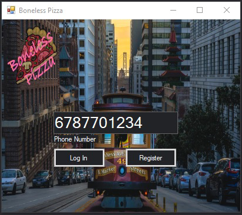
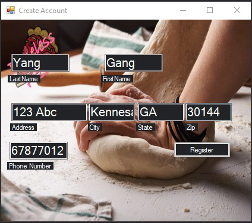
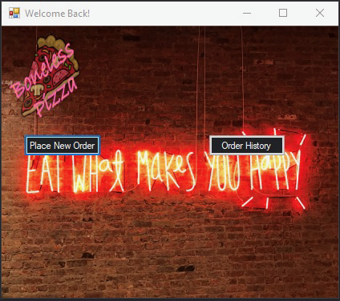
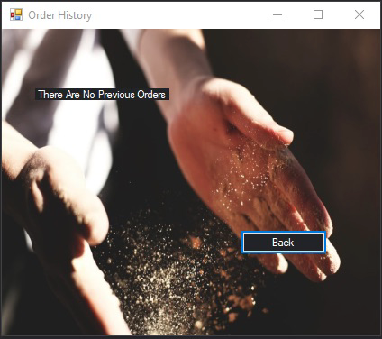
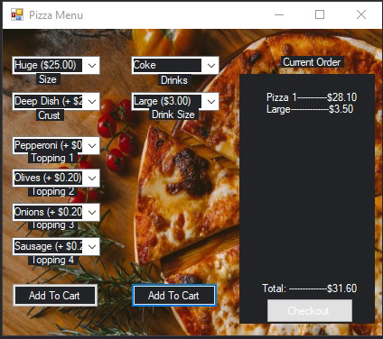
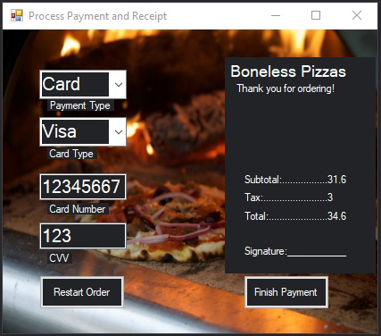

# BonelessPizzasTest
This is a project that was created by my team Phong Nguyen, Mark Jones, John Foster, and myself Ivan Gonzalez.

This project was created to test our abilities to make an entire application that was well thought out and to replicate a real pizza application like pizza hut, papa johns, etc.

The projects consists of a login page for new or returning customers. New customers can create an account for saved previous orders. After that is done the user gets a chance to place an order or to view thier order history that is saved on a database. After order is placed the user can pay with cash or other forms of payment. 

